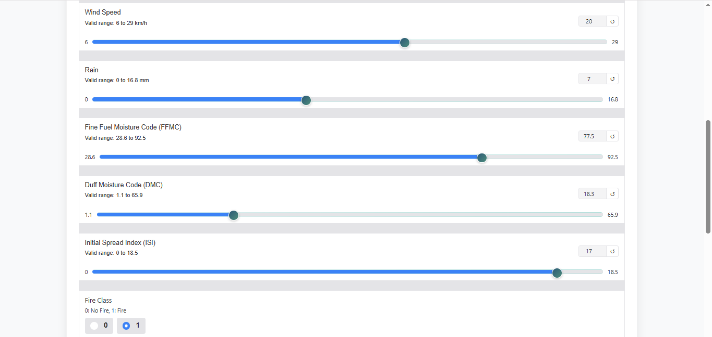

# Forest Fire Prediction

<div align="center" style="display: flex; flex-wrap: wrap; gap: 10px; justify-content: center; margin: 20px 0;">

[](https://huggingface.co/spaces/dhananjay1509/forest-fire-prediction)
[](https://www.python.org)
[](https://gradio.app/)
[](https://scikit-learn.org/)
[](https://numpy.org/)
[](https://pandas.pydata.org/)
[](https://opensource.org/licenses/MIT)

</div>

<style>
/* Badge container styling */
div[align="center"] {
    background: linear-gradient(to right, rgba(99, 102, 241, 0.1), rgba(0, 178, 72, 0.1));
    padding: 20px;
    border-radius: 10px;
    box-shadow: 0 4px 6px -1px rgba(0, 0, 0, 0.1);
}

/* Badge hover effects */
img[src*='shields.io'] {
    transition: all 0.3s ease;
}

img[src*='shields.io']:hover {
    transform: translateY(-2px) scale(1.02);
    filter: brightness(1.1);
    box-shadow: 0 4px 12px rgba(0, 0, 0, 0.15);
}

/* Responsive adjustments */
@media (max-width: 768px) {
    div[align="center"] {
        padding: 15px;
    }
    img[src*='shields.io'] {
        margin: 5px;
    }
}
</style>

---

Check out the configuration reference at https://huggingface.co/docs/hub/spaces-config-reference

## 📋 Table of Contents

- [Overview](#overview)
- [Features](#features)
- [Demo](#demo)
- [Installation](#installation)
- [Usage](#usage)
- [Input Parameters](#input-parameters)
- [Risk Levels](#risk-levels)
- [Technical Details](#technical-details)
- [Project Structure](#project-structure)
- [Contributing](#contributing)
- [License](#license)

## 🌟 Overview

This machine learning-based system predicts the Fire Weather Index (FWI) in forest areas using meteorological and environmental factors. It provides real-time risk assessment and recommendations for fire prevention and management.

## ✨ Features

- **Real-time Predictions**: Instant FWI calculations
- **Interactive Interface**: User-friendly web interface with intuitive controls
- **Risk Assessment**: Three-level risk classification system
- **Smart Recommendations**: Contextual advice based on risk levels
- **Input Validation**: Comprehensive parameter validation
- **Visual Feedback**: Color-coded results and clear visual indicators

## 🎮 Demo

Try the live demo on Hugging Face Spaces: [Forest Fire Prediction Demo](https://huggingface.co/spaces/dhananjay1509/forest-fire-prediction)





## 🚀 Installation

### Prerequisites

- Python 3.8 or higher
- pip package manager

### Setup Steps

```bash
# Clone the repository
git clone https://github.com/Dhananjay1509/forest-fire-prediction.git
cd forest-fire-prediction

# Create and activate virtual environment
python -m venv venv
source venv/bin/activate  # Linux/Mac
venv\Scripts\activate     # Windows

# Install dependencies
pip install -r requirements.txt

# Run the application
python app.py
```

## 💻 Usage

1. Access the web interface at `http://localhost:7861`
2. Input environmental parameters using the sliders
3. Select the region and fire class
4. Click "Predict Fire Weather Index"
5. Review the prediction, risk level, and recommendations

## 📊 Input Parameters

| Parameter         | Range     | Description                             |
| ----------------- | --------- | --------------------------------------- |
| Temperature       | 22-42°C   | Ambient temperature                     |
| Relative Humidity | 21-90%    | Air humidity percentage                 |
| Wind Speed        | 6-29 km/h | Wind velocity                           |
| Rain              | 0-16.8 mm | Rainfall amount                         |
| FFMC              | 28.6-92.5 | Fine Fuel Moisture Code                 |
| DMC               | 1.1-65.9  | Duff Moisture Code                      |
| ISI               | 0-18.5    | Initial Spread Index                    |
| Classes           | 0 or 1    | Fire occurrence (0: No, 1: Yes)         |
| Region            | 0 or 1    | Location (0: Bejaia, 1: Sidi-Bel Abbes) |

## 🎯 Risk Levels

### Low Risk (0-10)

- Regular monitoring recommended
- Standard fire prevention measures
- Suitable for controlled burns

### Moderate Risk (11-20)

- Enhanced monitoring required
- Increased vigilance needed
- Review of fire response procedures

### High Risk (>20)

- Immediate precautions necessary
- Constant monitoring required
- Emergency response team standby

## 🔧 Technical Details

### Model Architecture

- **Algorithm**: Ridge Regression with Cross-Validation (RidgeCV)

  - Selected for its robust performance with continuous target variables
  - Handles multicollinearity in weather-related features
  - Achieved R² Score: 0.984
  - Mean Absolute Error: 0.564

- **Feature Engineering**:

  - Input features correlation analysis (threshold: 0.85)
  - Removed highly correlated features to prevent multicollinearity
  - Feature scaling using StandardScaler
  - Normalized numerical features to [0,1] range

- **Model Pipeline**:

  1. Input Validation: Range-based checks for all parameters
  2. Feature Preprocessing: StandardScaler transformation
  3. Prediction: Ridge Regression model
  4. Post-processing: Risk level classification and recommendations

- **Performance Metrics**:
  - Cross-validation: 5-fold CV
  - Evaluation metrics: MAE, R² Score
  - Model persistence using pickle serialization

### Technologies Used

- **Backend**: Python, scikit-learn
- **Frontend**: Gradio 5.25.2+
- **Data Processing**: NumPy, Pandas
- **Model Serialization**: Pickle
- **Deployment**: Hugging Face Spaces
- **Version Control**: Git LFS for model files

## 📁 Project Structure

```
forest-fire-prediction/
│
├── app.py                 # Main application file
├── dataset/              # Dataset directory
│   └── Algerian_forest_fires_cleaned_dataset.csv
├── models/               # Model directory
│   ├── ridge.pkl         # Trained model
│   └── scaler.pkl        # Fitted scaler
├── notebooks/            # Jupyter notebooks
│   ├── EDA And FE Algerian Forest Fires.ipynb
│   └── Model Training.ipynb
├── venv/                 # Virtual environment
├── .env                  # Environment variables
├── .env.example          # Environment variables template
├── .gitattributes        # Git LFS configuration
├── .gitignore           # Git ignore rules
├── demo1.PNG             # Demo screenshots
├── demo2.PNG
├── demo3.PNG
├── deploy.py             # Deployment script
└── requirements.txt     # Dependencies
```

## 🤝 Contributing

1. Fork the repository
2. Create a feature branch (`git checkout -b feature/AmazingFeature`)
3. Commit changes (`git commit -m 'Add AmazingFeature'`)
4. Push to branch (`git push origin feature/AmazingFeature`)
5. Open a Pull Request

## 📄 License

Distributed under the MIT License. See `LICENSE` for more information.

## 👥 Authors

- Your Name - [GitHub](https://github.com/dhananjay1509)

## 🙏 Acknowledgments

- [UCI Machine Learning Repository](https://archive.ics.uci.edu/dataset/547/algerian+forest+fires+dataset) for providing the Algerian Forest Fires Dataset
- The research paper: "Predicting Forest Fire in Algeria using Data Mining Techniques: Case Study of the Decision Tree Algorithm" by Faroudja ABID et al.
- [Hugging Face](https://huggingface.co/) for hosting the demo application
- [Gradio](https://gradio.app/) team for the excellent UI framework
- All contributors and reviewers who helped improve this project

## 📧 Contact

Dhananjay Nerkar - nerkarr.dhananjay@gmail.com
Project Link: [https://github.com/Dhananjay1509/forest-fire-prediction](https://github.com/Dhananjay1509/forest-fire-prediction)


